
<h1 align="center">基于web的经典电影推荐网站的设计与实现+vue</h1>

## 简介
经典电影推荐网站：角色分为管理员、用户；支持电影推荐、用户评价、论坛交流、公告管理、用户信息管理、电影评论回复、后台电影与数据管理功能。    --计算机毕业设计源码；毕设源码；java毕业设计源码

## 联系方式

<h3 align="center">获取完整代码与数据库文件 + 微信：deepguan QQ: 86050149 QQ群: 783742310</h3>

<h3 align="center">可帮忙远程部署 包运行成功！提供远程部署、修改代码、设计文档指导、代码讲解等服务！</h3>

## 功能介绍（完整见运行截图）
管理员：基本功能包括登录、退出，管理导航功能如首页、用户管理、电影管理、基础数据管理、公告信息管理，并可对评论和论坛进行审核和回复。在电影管理中，管理员可以新增、修改、删除电影信息，并审核用户评论和公告信息管理，确保网站内容的规范。此外，管理员可查看和修改平台的基础数据，如电影类型和用户信息，以维护系统良好运作。

用户：主要功能为登录、退出及使用网站提供的推荐和互动服务。在个人中心，用户可以上传头像，修改个人信息如用户名、手机号、身份证号、邮箱和性别咨询。在电影部分，用户可以浏览和搜索电影列表，查看详情并参与评论互动。在论坛模块，用户可发帖、回复以及查看回帖详情，参与各类主题讨论，丰富社区交流体验。而在电影评价区，用户能撰写评论、查看其他用户的评价和参与评分活动，从而影响电影推荐算法。

## 运行截图

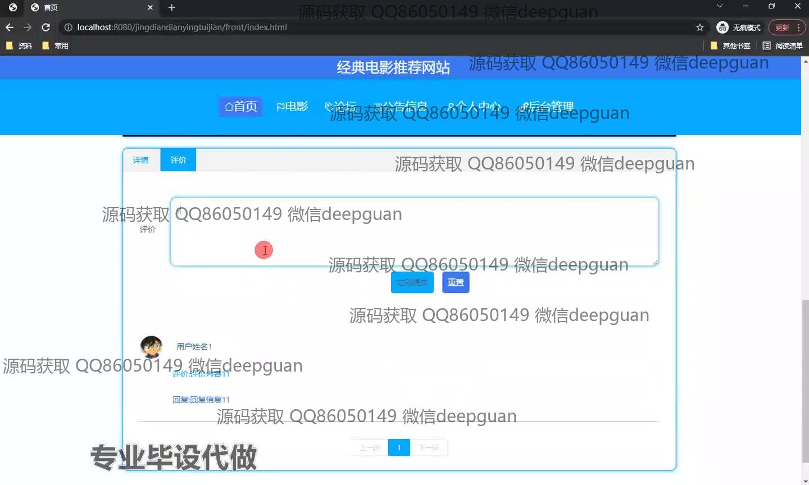
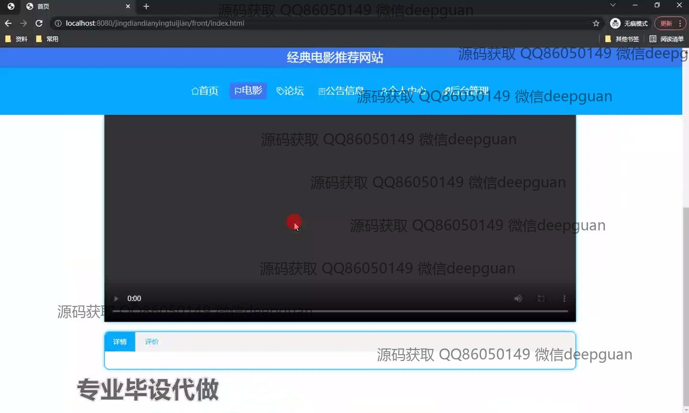
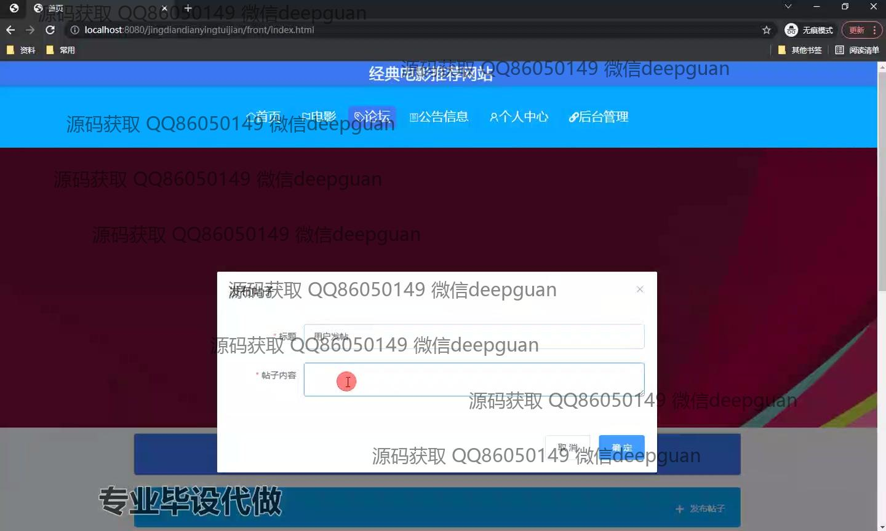
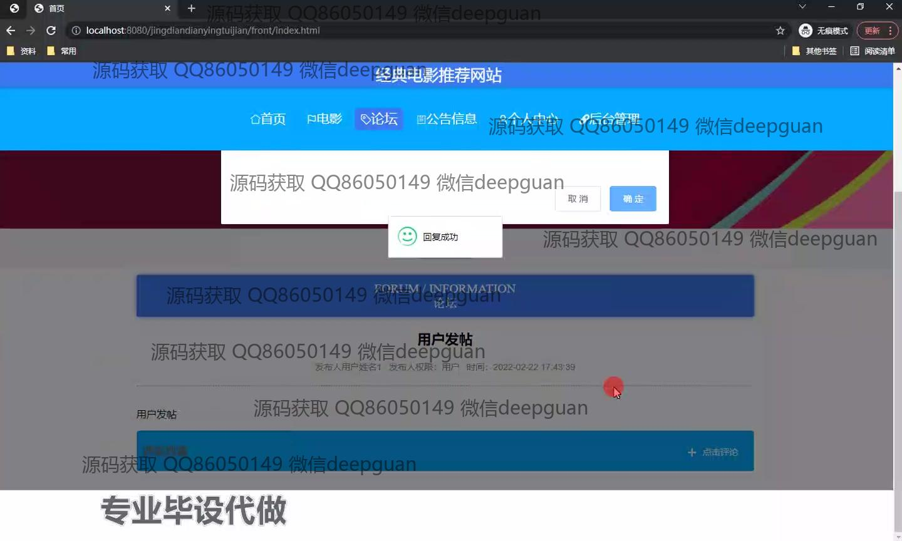
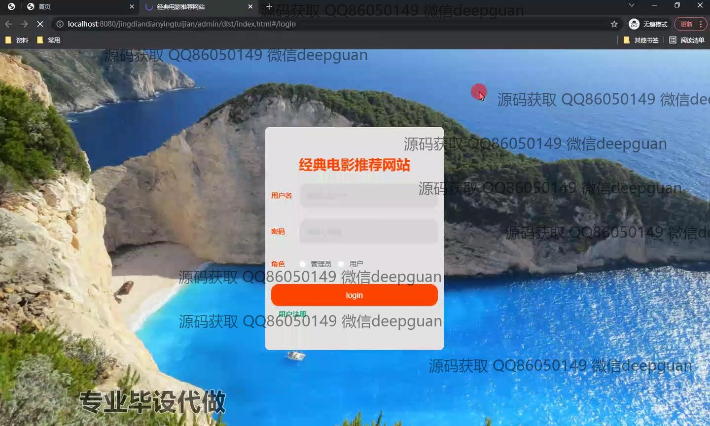
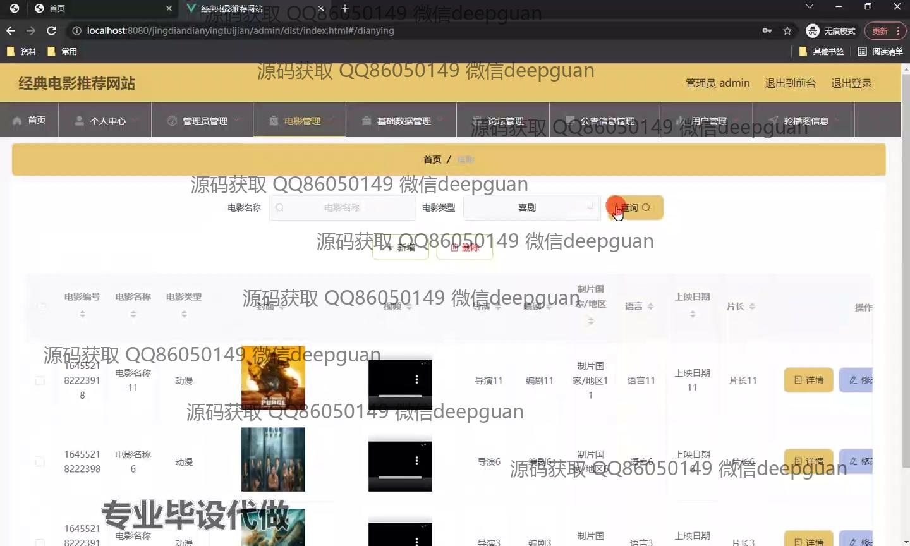
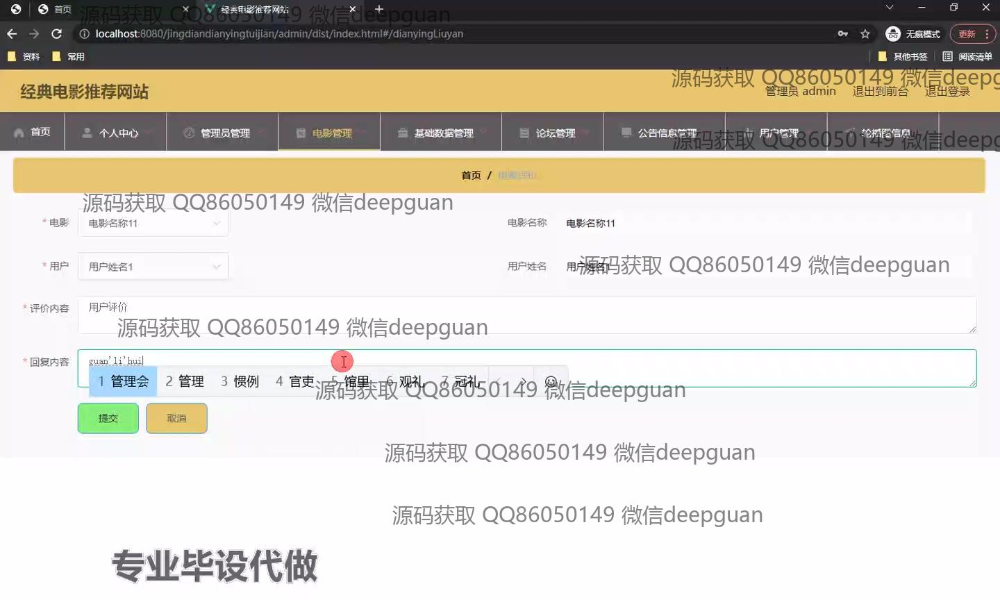
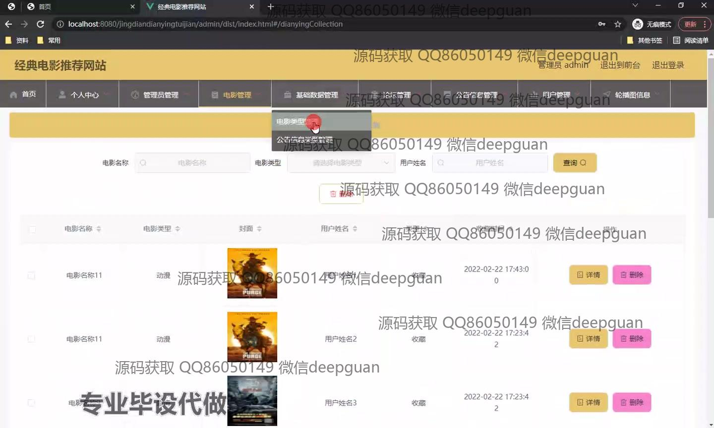
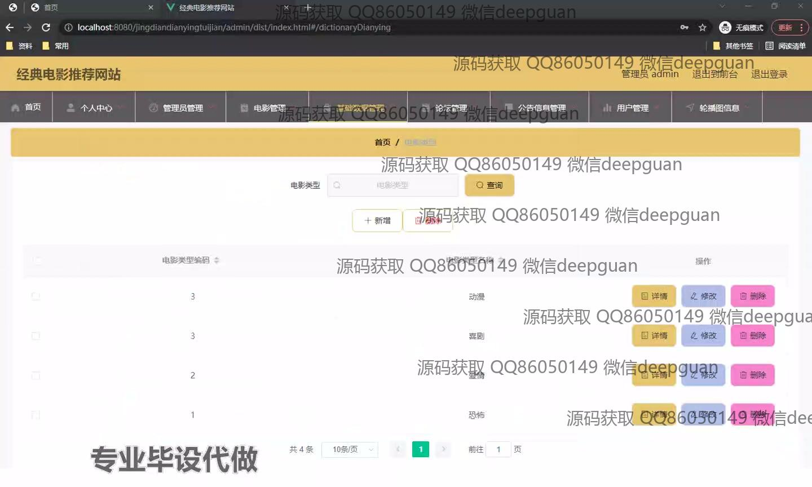
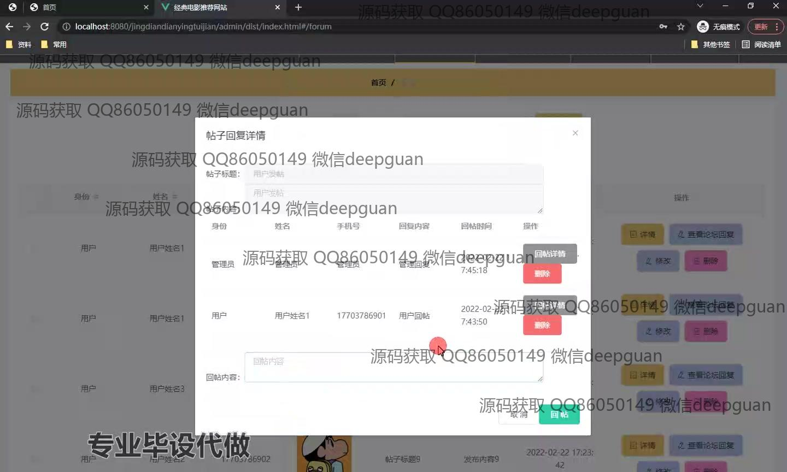
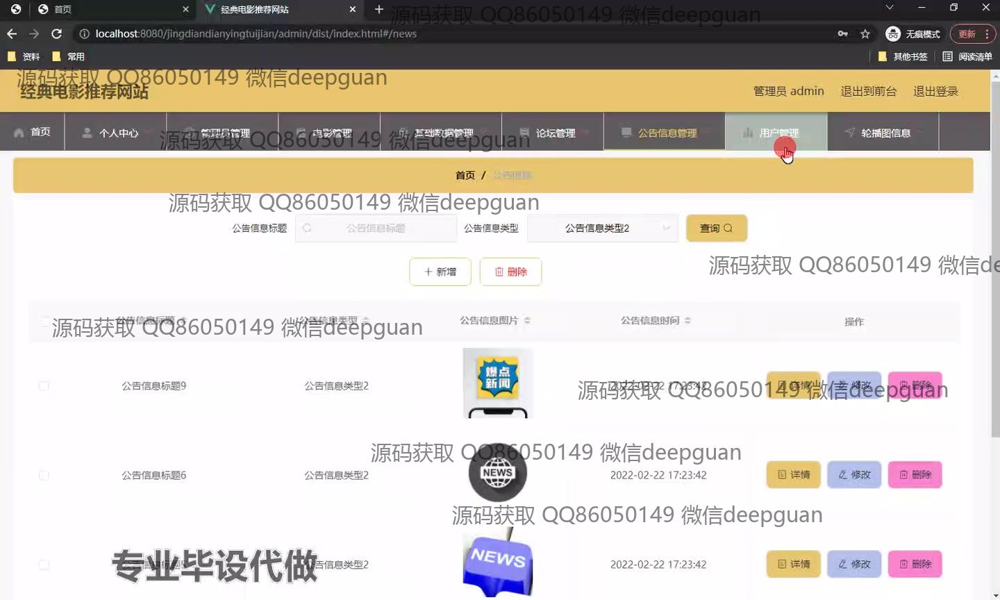
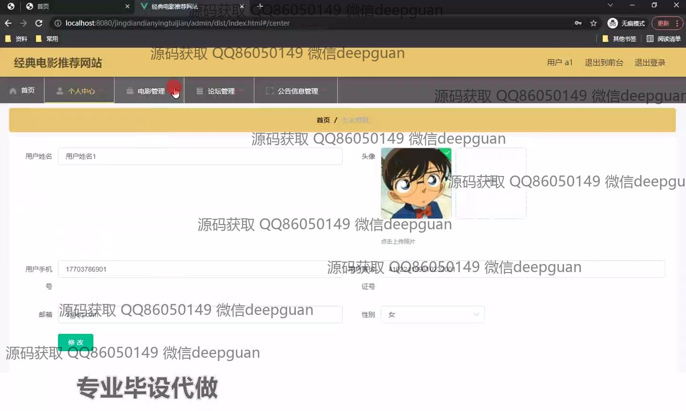
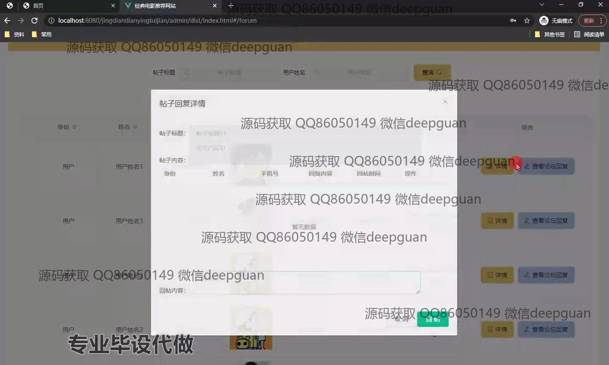

本代码来源于网络,仅供学习参考使用!

